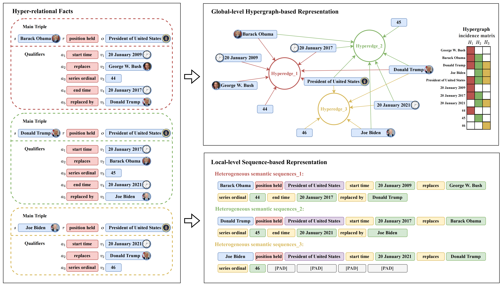
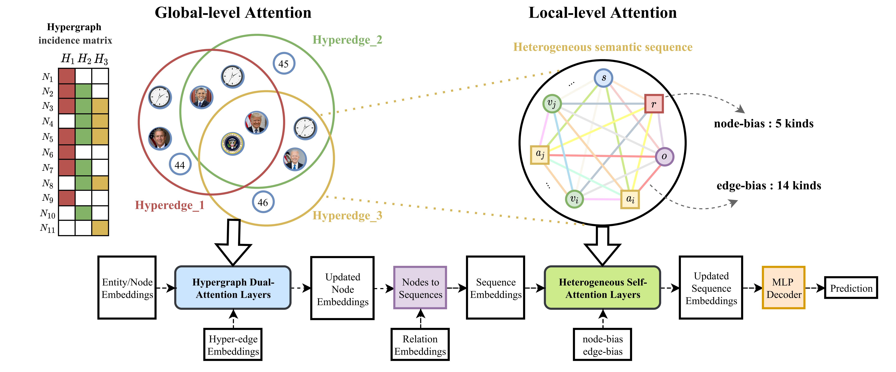

# HAHE

Official resources of **"HAHE: Hierarchical Attention for Hyper-Relational Knowledge Graphs in Global and Local Level"**. Haoran Luo, Haihong E, Yuhao Yang, Yikai Guo, Mingzhi Sun, Tianyu Yao, Zichen Tang, Kaiyang Wan, Meina Song, Wei Lin. **ACL 2023** \[[paper](https://arxiv.org/abs/2305.06588)\]. 

## Overview
The Global-level Hypergraph-based representation and Local-level Sequence-based representation based
on three examples of H-Facts in HKGs:


 The overview of HAHE model for Global-level and Local-level Representation of HKGs:


## Introduction

This is the [Pytorch](https://pytorch.org/) implementation of HAHE, a novel Hierarchical Attention model for
HKG Embedding, including global-level and local-level attentions. 

This repository contains the code and data, as well as the optimal configurations to reproduce the reported results.

## Requirements and Installation
This project should work fine with the following environments:
- Python 3.8.13 for data preprocessing, training and evaluation with:
    -  torch 1.10.0+cu113
    -  torch-scatter 2.0.9
    -  torch-sparse 0.6.13
    -  torch-cluster 1.6.0
    -  torch-geometric 2.1.0.post1
    -  numpy 1.23.3
- GPU with CUDA 11.3

All the experiments are conducted on a single 11G NVIDIA GeForce 1080Ti.

#### Setup with Conda

```
bash env.sh
```

## How to Run

### Step 1. Download raw data
We consider three representative n-ary relational datasets, and the datasets can be downloaded from:
- [JF17K](https://www.dropbox.com/sh/ryxohj363ujqhvq/AAAoGzAElmNnhXrWEj16UiUga?dl=0)
- [WikiPeople](https://github.com/gsp2014/WikiPeople)
- [WD50K](https://zenodo.org/record/4036498#.Yx06qoi-uNz)

### Step 2. Preprocess data
Then we convert the raw data into the required format for training and evaluation. The new data is organized into a directory named `data`, with a sub-directory for each dataset. In general, a sub-directory contains:
- `train.json`: train set
- `valid.json`: dev set
- `train+valid.json`: train set + dev set
- `test.json`: test set
- `all.json`: combination of train/dev/test sets, used only for *filtered* evaluation
- `vocab.txt`: vocabulary consisting of entities, relations, and special tokens like [MASK] and [PAD]

> Note: JF17K is the only one that provides no dev set.

### Step 3. Training & Evaluation

To train and evaluate the HAHE model, please run:

```
python -u ./src/run.py --name [TEST_NAME] --device [GPU_ID] -vocab_size [VOCAB_SIZE] --vocab_file [VOCAB_FILE] \
                       --train_file [TRAIN_FILE] --test_file [TEST_FILE] --ground_truth_file [GROUND_TRUTH_FILE] \
                       --num_workers [NUM_WORKERS] --num_relations [NUM_RELATIONS] \
                       --max_seq_len [MAX_SEQ_LEN] --max_arity [MAX_ARITY]
```

Here you should first create two directories to store the parameters and results of HAHE respectively, then you can set parameters of one dataset according to its statisitcs.
`[TEST_NAME]` is the unique name identifying one Training & Evaluation,  `[GPU_ID]` is the GPU ID you want to use.
`[VOCAB_SIZE]` is the number of vocab of the dataset.
`[VOCAB_FILE]` & `[TRAIN_FILE]` & `[TEST_FILE]` & `[GROUND_TRUTH_FILE]` are the paths storing the vocab file("vocab.txt"), train file("train.json"), test file("test.json") and ground truth file("all.json").
`[NUM_WORKERS]` is the number of workers when reading the data.
`[NUM_RELATIONS]` is the number of relations of the dataset.
`[MAX_ARITY]` is the maximum arity of N-arys in the datast, `[MAX_SEQ_LEN]` is the maximum length of N-ary sequences, which is equal to (2 * [MAX_ARITY] - 1).

Please modify those hyperparametes according to your needs and characteristics of different datasets.


For JF17K, to train and evalute on this dataset using default hyperparametes, please run:

```
python -u ./src/run.py --dataset "jf17k" --device "0" --vocab_size 29148 --vocab_file "./data/jf17k/vocab.txt" \
                       --train_file "./data/jf17k/train.json" --test_file "./data/jf17k/test.json" \
                       --ground_truth_file "./data/jf17k/all.json" --num_workers 1 --num_relations 501 \
                       --max_seq_len 11 --max_arity 6 --hidden_dim 256 --global_layers 2 \
                       --global_dropout 0.9 --global_activation "elu" --global_heads 4 --local_layers 12\
                       --local_dropout 0.35 --local_heads 4 --decoder_activation "gelu" --batch_size 1024 \
                       --lr 5e-4 --weight_deca 0.002 --entity_soft 0.9 --relation_soft 0.9 \
                       --hyperedge_dropout 0.85 --epoch 300 --warmup_proportion 0.05
```

For Wikipeople, to train and evalute on this dataset using default hyperparametes, please run:

```
python -u ./src/run.py --dataset "wikipeople" --device "0" --vocab_size 35005 --vocab_file "./data/wikipeople/vocab.txt" \
                       --train_file "./data/wikipeople/train+valid.json" --test_file "./data/wikipeople/test.json" \
                       --ground_truth_file "./data/wikipeople/all.json" --num_workers 1 --num_relations 178 \
                       --max_seq_len 13 --max_arity 7 --hidden_dim 256 --global_layers 2 \
                       --global_dropout 0.1 --global_activation "elu" --global_heads 4 --local_layers 12\
                       --local_dropout 0.1 --local_heads 4 --decoder_activation "gelu" --batch_size 1024 \
                       --lr 5e-4 --weight_deca 0.01 --entity_soft 0.2 --relation_soft 0.1 \
                       --hyperedge_dropout 0.99 --epoch 300 --warmup_proportion 0.1
```

For WD50K, to train and evalute on this dataset using default hyperparametes, please run:

```
python -u ./src/run.py --dataset "wd50k" --device "0" --vocab_size 47688 --vocab_file "./data/wd50k/vocab.txt" \
                       --train_file "./data/wd50k/train+valid.json" --test_file "./data/wd50k/test.json" \
                       --ground_truth_file "./data/wd50k/all.json" --num_workers 1 --num_relations 531 \
                       --max_seq_len 63 --max_arity 32 --hidden_dim 256 --global_layers 2 \
                       --global_dropout 0.1 --global_activation "elu" --global_heads 4 --local_layers 12\
                       --local_dropout 0.1 --local_heads 4 --decoder_activation "gelu" --batch_size 64 \
                       --lr 5e-4 --weight_deca 0.01 --entity_soft 0.2 --relation_soft 0.1 \
                       --hyperedge_dropout 0.0 --epoch 100 --warmup_proportion 0.1
```


## BibTex

If you find this work is helpful for your research, please cite:

```bibtex
@misc{luo2023hahe,
      title={HAHE: Hierarchical Attention for Hyper-Relational Knowledge Graphs in Global and Local Level}, 
      author={Haoran Luo and Haihong E and Yuhao Yang and Yikai Guo and Mingzhi Sun and Tianyu Yao and Zichen Tang and Kaiyang Wan and Meina Song and Wei Lin},
      year={2023},
      eprint={2305.06588},
      archivePrefix={arXiv},
      primaryClass={cs.AI}}
```

For further questions, please contact: luohaoran@bupt.edu.cn, or wechat: lhr1846205978.